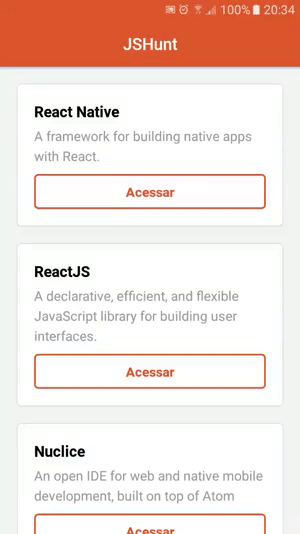

<h1 align="center">
  Hunt
</h1>

  <a href="#rocket-tecnologias">Tecnologias</a>&nbsp;&nbsp;&nbsp;|&nbsp;&nbsp;&nbsp;
  <a href="#computer-projeto">Projeto</a>&nbsp;&nbsp;&nbsp;|&nbsp;&nbsp;&nbsp;
  <a href="#construction-como-contribuir">Como contribuir</a>&nbsp;&nbsp;&nbsp;|&nbsp;&nbsp;&nbsp;
  <a href="#memo-licença">Licença</a>

## :rocket: Tecnologias

- [React](https://reactjs.org)
- [React Native](https://facebook.github.io/react-native/)

## :computer: Projeto

Hunt é um projeto que lista os repositórios Github armazenados em uma API Rest.

Projeto criado no curso [Starter React Native](https://rocketseat.com.br/starter/curso-gratuito-react-native) da [RocketSeat](https://rocketseat.com.br/).

&nbsp;
&nbsp;

## :construction: Como contribuir

- Faça um fork desse repositório;
- Cria uma branch com a sua feature: `git checkout -b minha-feature`;
- Faça commit das suas alterações: `git commit -m 'feat: Minha nova feature'`;
- Faça push para a sua branch: `git push origin minha-feature`.

Depois que o merge da sua pull request for feito, você pode deletar a sua branch.

Veja o arquivo [CONTRIBUTING](CONTRIBUTING.md) para mais detalhes.

## :memo: Licença

Esse projeto está sob a licença MIT. Veja o arquivo [LICENSE](LICENSE.md) para mais detalhes.

---
Lincoln S. Brito 